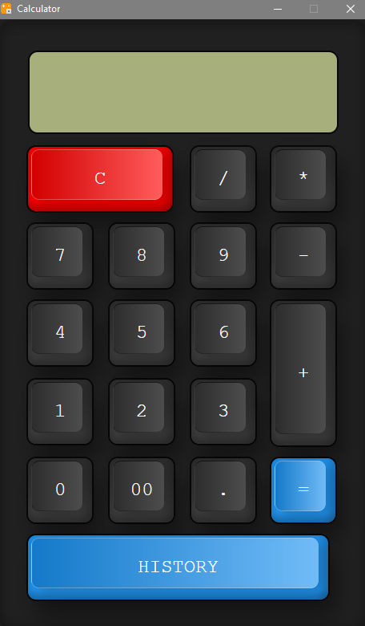

# Electron Calculator

This repository contains an Electron-based calculator.

## Example

## Installation

If you do not want to run the calculator using Electron, you can download the standalone version from the following link:

[Download Calculator](calculator-win32-x64.rar)

## Running Electron Calculator

To run the calculator using Electron, follow these steps:

1. Clone the repository: `git clone https://github.com/LRxDarkDevil/Electron-Calculator.git`
2. Install dependencies: `npm install`
3. Start the Electron application: `electron .`

## Frontend Code

The frontend code used in this project is from [gambhirsharma's CodePen](https://codepen.io/gambhirsharma/pen/ExwBKop). Special thanks to gambhirsharma for the code.

## Usage

- Perform basic arithmetic operations.
- Clear the input field.

Enjoy calculating with Electron Calculator!
